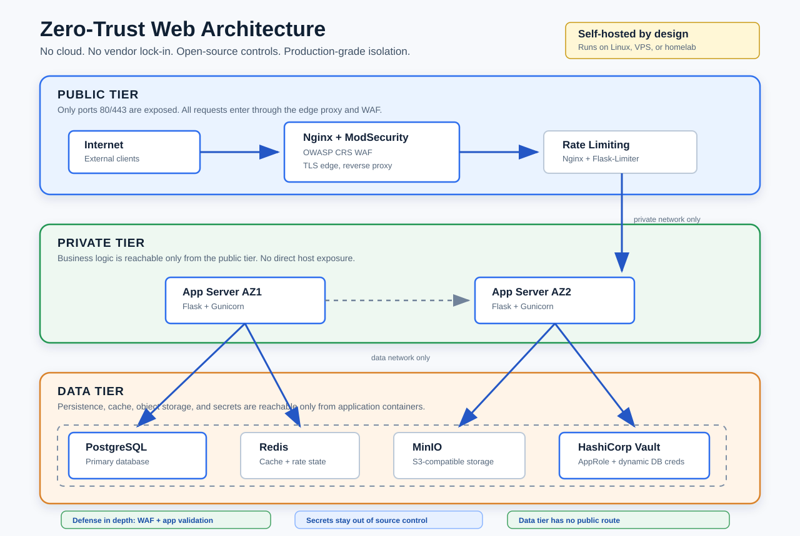

# 🛡️ Zero-Trust Multi-Tier Web Architecture (Self-Hosted)

> **No cloud. No vendor lock-in. Full security. Production-grade.**
>
> This project replicates a hardened AWS-style 3-tier VPC architecture using 100% open-source tools —
> runnable on any Linux machine, VPS, or homelab.

---

## 📐 Architecture Overview



### Why 3 Tiers?
| Tier | Purpose | Exposed? |
|------|---------|---------|
| Public | Edge — absorbs all internet traffic, runs WAF | Port 80/443 only |
| Private | Business logic — app servers, workers | Never directly |
| Data | Persistence — DB, cache, secrets, storage | Never directly |

This mirrors the AWS VPC pattern: **public subnet → private subnet → data subnet**.
If an attacker breaches the public tier, they cannot reach the database directly.
They would need to pivot through the app tier, which has its own isolation controls.

---

## 🔄 Tool Substitution Map

| AWS Service | Open-Source Equivalent | Why This Choice |
|---|---|---|
| VPC Subnets | Docker bridge networks | Docker networks are kernel-level isolation using Linux namespaces — not just firewall rules |
| EC2 Auto Scaling | Docker Swarm replicas | Swarm natively scales containers up/down and handles rolling updates |
| Application Load Balancer (ALB) | Nginx upstream | Nginx is the most battle-tested reverse proxy; used by 34% of top 1M sites |
| AWS WAF | ModSecurity (OWASP CRS) | ModSecurity is the industry-standard open-source WAF, same rules as commercial solutions |
| RDS (PostgreSQL) | PostgreSQL + Replication | Self-managed gives full control; production PostgreSQL is identical to AWS RDS PostgreSQL |
| Secrets Manager | HashiCorp Vault | Vault is the gold standard for secret management — it's what many AWS customers use *alongside* AWS |
| S3 | MinIO | MinIO is S3-compatible (same API), runs on-prem, used by Fortune 500s |
| DynamoDB | Redis | Redis handles key-value, sessions, and caching with similar speed characteristics |
| VPC Endpoints | Docker internal networks | Services communicate via Docker DNS names — traffic never leaves the host |
| CloudWatch | Prometheus + Grafana | Best-in-class open-source observability stack |
| Terraform (AWS provider) | Terraform (Docker provider) | Same HCL syntax — your Terraform skills transfer directly to AWS |

---

## 📦 Prerequisites

```bash
# Check versions
docker --version        # Docker 24.0+
docker compose version  # Docker Compose v2.20+
terraform --version     # Terraform 1.6+
vault --version         # HashiCorp Vault 1.15+

# Install on Ubuntu/Debian
sudo apt-get update
sudo apt-get install -y docker.io docker-compose-v2

# Install Terraform
wget -O- https://apt.releases.hashicorp.com/gpg | sudo gpg --dearmor -o /usr/share/keyrings/hashicorp-archive-keyring.gpg
echo "deb [signed-by=/usr/share/keyrings/hashicorp-archive-keyring.gpg] https://apt.releases.hashicorp.com $(lsb_release -cs) main" | sudo tee /etc/apt/sources.list.d/hashicorp.list
sudo apt-get update && sudo apt-get install terraform vault

# Add your user to docker group (avoid running as root)
sudo usermod -aG docker $USER
newgrp docker
```

---

## 🚀 Quick Start

```bash
git clone https://github.com/YOUR_USERNAME/zero-trust-architecture
cd zero-trust-architecture

# 1. Generate secrets and initialize Vault
./scripts/init-vault.sh

# 2. Deploy the full stack via Terraform
cd terraform
terraform init
terraform plan
terraform apply

# 3. Verify all tiers are running
docker ps
curl http://localhost/health

# 4. Run security tests
./scripts/security-test.sh
```

---

## 📁 Project Structure

```
zero-trust-architecture/
├── README.md                   ← You are here
├── docker-compose.yml          ← Full stack definition
├── terraform/
│   ├── main.tf                 ← Infrastructure as Code (Docker provider)
│   ├── networks.tf             ← VPC-equivalent network isolation
│   ├── variables.tf
│   └── outputs.tf
├── nginx/
│   ├── nginx.conf              ← Reverse proxy + load balancer config
│   ├── security-headers.conf   ← Hardened HTTP security headers
│   └── modsecurity/
│       ├── modsecurity.conf    ← WAF engine config
│       └── crs-setup.conf      ← OWASP Core Rule Set
├── app/
│   ├── Dockerfile
│   ├── main.py                 ← Flask app with input sanitization
│   ├── sanitize.py             ← Reusable input validation library
│   └── requirements.txt
├── vault/
│   ├── config.hcl              ← Vault server config
│   └── policies/
│       └── app-policy.hcl      ← Least-privilege secret access
├── scripts/
│   ├── init-vault.sh           ← Secret initialization
│   ├── rotate-secrets.sh       ← Automated secret rotation
│   └── security-test.sh        ← WAF + injection tests
└── .github/
    └── workflows/
        └── security-scan.yml   ← CI/CD with Trivy + Semgrep
```

---

## 🌐 TIER 1: Public Tier — Nginx + ModSecurity WAF

### Why Nginx over Apache/Caddy?
- **Performance**: Event-driven, non-blocking — handles 10k+ concurrent connections
- **ModSecurity support**: Native integration with `nginx-mod-security`
- **Industry standard**: Used as the edge proxy for Netflix, GitHub, Cloudflare internals

### Why ModSecurity over simple firewall rules?
Regular firewalls (iptables/ufw) operate at Layer 3/4 (IP/TCP).
ModSecurity operates at Layer 7 (HTTP) — it can read the actual request body
and detect SQL injection in a POST parameter, which a firewall cannot.

```
Request → [iptables: blocks bad IPs] → [Nginx: rate limits] → [ModSecurity: inspects payload] → App
```

**See**: `nginx/nginx.conf` and `nginx/modsecurity/`

---

## 🖥️ TIER 2: Private Tier — Application Servers

### Why Flask + Gunicorn over Node.js?
Both are valid. Flask was chosen because:
- Python has the richest security library ecosystem (`bleach`, `validators`, `pydantic`)
- Gunicorn is production-tested, easy to configure worker count
- If you prefer Node.js, the sanitization patterns are identical

### Input Sanitization Strategy (Zero Trust for User Input)

```
Raw Input → Type Check → Length Check → Allowlist Validation → Sanitize → Use
```

Never trust user input even after WAF inspection. The WAF is a defense-in-depth layer,
not a replacement for application-level sanitization.

**See**: `app/sanitize.py` for the full validation library

---

## 🗄️ TIER 3: Data Tier — PostgreSQL + Vault + MinIO

### Why PostgreSQL over MySQL?
- ACID compliance is stronger in edge cases
- Better JSON support (JSONB)
- `pg_crypto` extension for column-level encryption
- RDS PostgreSQL is just managed PostgreSQL — skills transfer 1:1

### Why HashiCorp Vault over .env files?
| .env Files | HashiCorp Vault |
|---|---|
| Stored in plaintext | Encrypted at rest (AES-256-GCM) |
| No audit log | Full audit trail of every secret read |
| Manual rotation | Automated rotation on a schedule |
| Committed to git accidentally | Never touches the filesystem |
| No access control | Fine-grained policy per service |

**See**: `vault/config.hcl` and `vault/policies/`

---

## 🔒 Security Features Checklist

- [x] **Network isolation**: 3 Docker networks — public/private/data — with explicit firewall rules
- [x] **WAF (Layer 7)**: ModSecurity with OWASP CRS blocks SQLi, XSS, LFI, RFI
- [x] **Rate limiting**: Nginx limits 10 req/s per IP on public endpoints
- [x] **Input sanitization**: Type, length, allowlist, and encoding validation on all inputs
- [x] **Secrets management**: HashiCorp Vault — no credentials in environment variables or files
- [x] **Secret rotation**: Vault dynamic credentials rotate PostgreSQL passwords every 24h
- [x] **Least privilege**: App servers have read-only Vault tokens; cannot access other secrets
- [x] **Security headers**: HSTS, CSP, X-Frame-Options, X-Content-Type-Options on all responses
- [x] **TLS everywhere**: Self-signed certs for local dev; swap in Let's Encrypt for production
- [x] **Container hardening**: All containers run as non-root users
- [x] **Image scanning**: Trivy scans all Docker images in CI/CD pipeline
- [x] **Dependency scanning**: Semgrep SAST runs on every push

---

## 🔗 GitHub Setup

See the bottom of this README for the step-by-step GitHub publishing guide.
